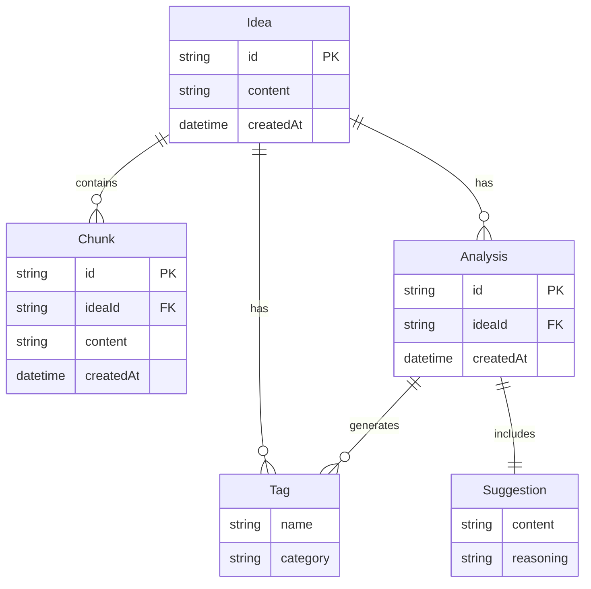

# 設計書

## 概要

アイデア分類CLIは、ソフトウェアアイデアの蓄積・分類・評価を支援するツールです。本設計では、オニオンアーキテクチャを採用し、ドメイン層・アプリケーション層・インフラストラクチャ層・プレゼンテーション層を明確に分離します。これにより、将来的なWebアプリケーションへの移行やLLMプロバイダーの変更に柔軟に対応できます。

## アーキテクチャ

### オニオンアーキテクチャの採用理由

1. **関心の分離**: ビジネスロジックをインフラストラクチャから独立させる
2. **テスト容易性**: 各層を独立してテスト可能
3. **付け替え可能性**: CLI → Web UI、SQLite → PostgreSQLなどの変更が容易
4. **依存性の方向**: 外側の層が内側の層に依存し、逆はない

### 層の構成

```
┌─────────────────────────────────────┐
│   プレゼンテーション層 (CLI/Web)    │
├─────────────────────────────────────┤
│   インフラストラクチャ層            │
│   (DB, LLM, ファイルシステム)       │
├─────────────────────────────────────┤
│   アプリケーション層                │
│   (ユースケース)                    │
├─────────────────────────────────────┤
│   ドメイン層                        │
│   (エンティティ, 値オブジェクト)    │
└─────────────────────────────────────┘
```

## コンポーネントとインターフェース

### ドメイン層

ドメイン層は、ビジネスロジックの中核を担い、他の層に依存しません。

#### エンティティ

**Idea (アイデア)**
```
class Idea:
  - id: IdeaId
  - content: string
  - createdAt: DateTime
  - chunks: List<Chunk>
  - tags: List<Tag>
  - analyses: List<Analysis>
  
  + addChunk(content: string): Chunk
  + addTag(tag: Tag): void
  + removeTag(tag: Tag): void
  + addAnalysis(analysis: Analysis): void
```

**Chunk (追記チャンク)**
```
class Chunk:
  - id: ChunkId
  - content: string
  - createdAt: DateTime
```

**Tag (タグ)**
```
class Tag:
  - name: string
  - category: TagCategory
```

**Analysis (分析結果)**
```
class Analysis:
  - id: AnalysisId
  - generatedTags: List<Tag>
  - suggestion: Suggestion
  - createdAt: DateTime
```

**Suggestion (行動指針)**
```
class Suggestion:
  - content: string
  - reasoning: string
```

#### 値オブジェクト

**IdeaId**
```
class IdeaId:
  - value: string
  
  + equals(other: IdeaId): boolean
```

**ChunkId**
```
class ChunkId:
  - value: string
  
  + equals(other: ChunkId): boolean
```

**AnalysisId**
```
class AnalysisId:
  - value: string
  
  + equals(other: AnalysisId): boolean
```

**TagCategory (列挙型)**
```
enum TagCategory:
  - NATURE (性質)
  - SCALE (規模感)
  - DIFFICULTY (技術難易度)
  - PHASE (開発フェーズ)
  - RISK (リスク)
  - DOMAIN (領域)
```

#### リポジトリインターフェース

**IIdeaRepository**
```
interface IIdeaRepository:
  + save(idea: Idea): void
  + findById(id: IdeaId): Idea | null
  + findAll(): List<Idea>
  + update(idea: Idea): void
```

#### LLMサービスインターフェース

**ILLMService**
```
interface ILLMService:
  + generateTags(ideaContent: string, chunks: List<Chunk>): List<Tag>
  + generateSuggestion(ideaContent: string, chunks: List<Chunk>, tags: List<Tag>): Suggestion
```

### アプリケーション層

アプリケーション層は、ユースケースを実装し、ドメイン層のエンティティとインターフェースを使用します。

#### ユースケース

**AddIdeaUseCase**
```
class AddIdeaUseCase:
  - repository: IIdeaRepository
  
  constructor(repository: IIdeaRepository)
  
  + execute(content: string): IdeaId
    - 新しいIdeaを作成
    - repositoryに保存
    - IdeaIdを返す
```

**AppendChunkUseCase**
```
class AppendChunkUseCase:
  - repository: IIdeaRepository
  
  constructor(repository: IIdeaRepository)
  
  + execute(ideaId: IdeaId, content: string): void
    - ideaIdでIdeaを取得
    - Chunkを追加
    - repositoryを更新
```

**ListIdeasUseCase**
```
class ListIdeasUseCase:
  - repository: IIdeaRepository
  
  constructor(repository: IIdeaRepository)
  
  + execute(): List<IdeaSummary>
    - すべてのIdeaを取得
    - IdeaSummaryのリストに変換
    - 登録日時の降順でソート
```

**ShowIdeaUseCase**
```
class ShowIdeaUseCase:
  - repository: IIdeaRepository
  
  constructor(repository: IIdeaRepository)
  
  + execute(ideaId: IdeaId): IdeaDetail
    - ideaIdでIdeaを取得
    - IdeaDetailに変換
```

**AnalyzeIdeaUseCase**
```
class AnalyzeIdeaUseCase:
  - repository: IIdeaRepository
  - llmService: ILLMService
  
  constructor(repository: IIdeaRepository, llmService: ILLMService)
  
  + execute(ideaId: IdeaId): Analysis
    - ideaIdでIdeaを取得
    - llmServiceでタグを生成
    - Analysisを作成
    - Ideaに追加
    - repositoryを更新
```

**SuggestActionUseCase**
```
class SuggestActionUseCase:
  - repository: IIdeaRepository
  - llmService: ILLMService
  
  constructor(repository: IIdeaRepository, llmService: ILLMService)
  
  + execute(ideaId: IdeaId): Suggestion
    - ideaIdでIdeaを取得
    - llmServiceで提案を生成
    - Analysisを作成
    - Ideaに追加
    - repositoryを更新
```

**AddTagUseCase**
```
class AddTagUseCase:
  - repository: IIdeaRepository
  
  constructor(repository: IIdeaRepository)
  
  + execute(ideaId: IdeaId, tag: Tag): void
    - ideaIdでIdeaを取得
    - タグを追加
    - repositoryを更新
```

**RemoveTagUseCase**
```
class RemoveTagUseCase:
  - repository: IIdeaRepository
  
  constructor(repository: IIdeaRepository)
  
  + execute(ideaId: IdeaId, tag: Tag): void
    - ideaIdでIdeaを取得
    - タグを削除
    - repositoryを更新
```

#### DTO (Data Transfer Object)

**IdeaSummary**
```
class IdeaSummary:
  - id: string
  - content: string (最初の100文字)
  - createdAt: DateTime
  - tagCount: number
```

**IdeaDetail**
```
class IdeaDetail:
  - id: string
  - content: string
  - createdAt: DateTime
  - chunks: List<ChunkDetail>
  - tags: List<TagDetail>
  - analyses: List<AnalysisDetail>
```

**ChunkDetail**
```
class ChunkDetail:
  - content: string
  - createdAt: DateTime
```

**TagDetail**
```
class TagDetail:
  - name: string
  - category: string
```

**AnalysisDetail**
```
class AnalysisDetail:
  - generatedTags: List<TagDetail>
  - suggestion: string
  - reasoning: string
  - createdAt: DateTime
```

### インフラストラクチャ層

インフラストラクチャ層は、ドメイン層のインターフェースを実装します。

#### リポジトリ実装

**SQLiteIdeaRepository**
```
class SQLiteIdeaRepository implements IIdeaRepository:
  - dbPath: string
  
  constructor(dbPath: string)
  
  + save(idea: Idea): void
    - SQLiteにINSERT
  
  + findById(id: IdeaId): Idea | null
    - SQLiteからSELECT
    - Ideaオブジェクトに変換
  
  + findAll(): List<Idea>
    - SQLiteからSELECT ALL
    - Ideaオブジェクトのリストに変換
  
  + update(idea: Idea): void
    - SQLiteでUPDATE
```

#### LLMサービス実装

**OpenAILLMService**
```
class OpenAILLMService implements ILLMService:
  - apiKey: string
  - model: string
  
  constructor(apiKey: string, model: string)
  
  + generateTags(ideaContent: string, chunks: List<Chunk>): List<Tag>
    - プロンプトを構築
    - OpenAI APIを呼び出し
    - レスポンスをパース
    - Tagのリストに変換
  
  + generateSuggestion(ideaContent: string, chunks: List<Chunk>, tags: List<Tag>): Suggestion
    - プロンプトを構築
    - OpenAI APIを呼び出し
    - レスポンスをパース
    - Suggestionに変換
```

#### データベーススキーマ

**ideas テーブル**
```sql
CREATE TABLE ideas (
  id TEXT PRIMARY KEY,
  content TEXT NOT NULL,
  created_at TEXT NOT NULL
);
```

**chunks テーブル**
```sql
CREATE TABLE chunks (
  id TEXT PRIMARY KEY,
  idea_id TEXT NOT NULL,
  content TEXT NOT NULL,
  created_at TEXT NOT NULL,
  FOREIGN KEY (idea_id) REFERENCES ideas(id)
);
```

**tags テーブル**
```sql
CREATE TABLE tags (
  id INTEGER PRIMARY KEY AUTOINCREMENT,
  idea_id TEXT NOT NULL,
  name TEXT NOT NULL,
  category TEXT NOT NULL,
  FOREIGN KEY (idea_id) REFERENCES ideas(id)
);
```

**analyses テーブル**
```sql
CREATE TABLE analyses (
  id TEXT PRIMARY KEY,
  idea_id TEXT NOT NULL,
  suggestion_content TEXT NOT NULL,
  suggestion_reasoning TEXT NOT NULL,
  created_at TEXT NOT NULL,
  FOREIGN KEY (idea_id) REFERENCES ideas(id)
);
```

**analysis_tags テーブル**
```sql
CREATE TABLE analysis_tags (
  analysis_id TEXT NOT NULL,
  tag_name TEXT NOT NULL,
  tag_category TEXT NOT NULL,
  PRIMARY KEY (analysis_id, tag_name),
  FOREIGN KEY (analysis_id) REFERENCES analyses(id)
);
```

### プレゼンテーション層

プレゼンテーション層は、ユーザーインターフェースを提供します。

#### CLIコントローラー

**CLIController**
```
class CLIController:
  - addIdeaUseCase: AddIdeaUseCase
  - appendChunkUseCase: AppendChunkUseCase
  - listIdeasUseCase: ListIdeasUseCase
  - showIdeaUseCase: ShowIdeaUseCase
  - analyzeIdeaUseCase: AnalyzeIdeaUseCase
  - suggestActionUseCase: SuggestActionUseCase
  - addTagUseCase: AddTagUseCase
  - removeTagUseCase: RemoveTagUseCase
  
  constructor(
    addIdeaUseCase: AddIdeaUseCase,
    appendChunkUseCase: AppendChunkUseCase,
    listIdeasUseCase: ListIdeasUseCase,
    showIdeaUseCase: ShowIdeaUseCase,
    analyzeIdeaUseCase: AnalyzeIdeaUseCase,
    suggestActionUseCase: SuggestActionUseCase,
    addTagUseCase: AddTagUseCase,
    removeTagUseCase: RemoveTagUseCase
  )
  
  + handleCommand(args: List<string>): void
    - コマンドをパース
    - 適切なユースケースを呼び出し
    - 結果を表示
```

#### コマンドハンドラー

**AddIdeaCommandHandler**
```
class AddIdeaCommandHandler:
  - useCase: AddIdeaUseCase
  
  + handle(content: string): void
    - 入力検証
    - useCaseを実行
    - 成功メッセージを表示
```

**AppendChunkCommandHandler**
```
class AppendChunkCommandHandler:
  - useCase: AppendChunkUseCase
  
  + handle(ideaId: string, content: string): void
    - 入力検証
    - useCaseを実行
    - 成功メッセージを表示
```

**ListIdeasCommandHandler**
```
class ListIdeasCommandHandler:
  - useCase: ListIdeasUseCase
  
  + handle(): void
    - useCaseを実行
    - 一覧を整形して表示
```

**ShowIdeaCommandHandler**
```
class ShowIdeaCommandHandler:
  - useCase: ShowIdeaUseCase
  
  + handle(ideaId: string): void
    - 入力検証
    - useCaseを実行
    - 詳細を整形して表示
```

**AnalyzeIdeaCommandHandler**
```
class AnalyzeIdeaCommandHandler:
  - useCase: AnalyzeIdeaUseCase
  
  + handle(ideaId: string): void
    - 入力検証
    - useCaseを実行
    - 分析結果を表示
```

**SuggestActionCommandHandler**
```
class SuggestActionCommandHandler:
  - useCase: SuggestActionUseCase
  
  + handle(ideaId: string): void
    - 入力検証
    - useCaseを実行
    - 提案を表示
```

## データモデル

### エンティティ関係図



### ドメインモデルの制約

1. **Idea**: 
   - contentは空文字列不可
   - chunksは時系列順に保持
   - tagsは重複不可
   - analysesは時系列順に保持

2. **Chunk**:
   - contentは空文字列不可

3. **Tag**:
   - nameは空文字列不可
   - categoryは定義済みのTagCategoryのいずれか

4. **Analysis**:
   - generatedTagsは空リスト可
   - suggestionは必須

## 正しさのプロパティ

プロパティとは、システムのすべての有効な実行において真であるべき特性や振る舞いのことです。プロパティは、人間が読める仕様と機械が検証可能な正しさの保証との橋渡しをします。


### プロパティ1: アイデア保存のラウンドトリップ

*任意の*有効なアイデア内容に対して、アイデアを保存してから取得すると、同じ内容が返される

**検証: 要件 1.1, 9.1**

### プロパティ2: アイデアIDの一意性

*任意の*複数のアイデアに対して、すべてのアイデアIDは一意である

**検証: 要件 1.2**

### プロパティ3: エンティティ作成時のタイムスタンプ記録

*任意の*エンティティ（Idea、Chunk、Analysis）に対して、作成時にcreatedAtフィールドが設定され、妥当な日時値を持つ

**検証: 要件 1.3, 2.2, 5.4, 7.5**

### プロパティ4: 空文字列入力の拒否

*任意の*空文字列または空白のみの文字列に対して、アイデアまたはチャンクの作成はエラーを返す

**検証: 要件 1.4, 2.5**

### プロパティ5: チャンク追加のラウンドトリップ

*任意の*有効なアイデアとチャンク内容に対して、チャンクを追加してから取得すると、同じ内容が返される

**検証: 要件 2.1, 9.2**

### プロパティ6: チャンク追加時の元データ不変性

*任意の*アイデアに対して、チャンクを追加しても元のアイデア内容は変更されない

**検証: 要件 2.3**

### プロパティ7: 存在しないIDへの操作エラー

*任意の*存在しないアイデアIDに対して、操作（追記、詳細表示、タグ編集）はエラーを返す

**検証: 要件 2.4, 4.3, 6.3**

### プロパティ8: アイデア一覧の完全性

*任意の*アイデアセットに対して、一覧表示はすべてのアイデアのID、登録日時、本文の要約を含む

**検証: 要件 3.1**

### プロパティ9: アイデア一覧の時系列ソート

*任意の*アイデアセットに対して、一覧表示は登録日時の降順でソートされる

**検証: 要件 3.3**

### プロパティ10: アイデア詳細の完全性

*任意の*アイデアに対して、詳細表示はアイデアの本文、すべてのChunk、タグ、分析結果を含む

**検証: 要件 4.1**

### プロパティ11: チャンク表示時の日時情報

*任意の*チャンクに対して、表示時に追記日時が含まれる

**検証: 要件 4.2**

### プロパティ12: LLMサービスの呼び出し

*任意の*分析または提案要求に対して、LLMサービスが適切なパラメータで呼び出される

**検証: 要件 5.1, 7.1**

### プロパティ13: タグ保存のラウンドトリップ

*任意の*有効なタグセットに対して、タグを保存してから取得すると、同じタグが返される

**検証: 要件 5.2, 9.3**

### プロパティ14: LLM通信エラーの適切な処理

*任意の*LLM通信エラーに対して、システムはエラーメッセージを返し、処理を中断する

**検証: 要件 5.5**

### プロパティ15: タグ追加のラウンドトリップ

*任意の*アイデアとタグに対して、タグを追加してから取得すると、そのタグが含まれる

**検証: 要件 6.1**

### プロパティ16: タグ追加と削除の往復

*任意の*アイデアとタグに対して、タグを追加してから削除すると、元の状態に戻る

**検証: 要件 6.2**

### プロパティ17: 提案保存のラウンドトリップ

*任意の*有効な提案に対して、提案を保存してから取得すると、同じ内容が返される

**検証: 要件 7.2, 9.4**

### プロパティ18: 分析結果の追加

*任意の*アイデアに対して、分析を実行するたびに分析結果の数が増加する

**検証: 要件 8.1**

### プロパティ19: 分析追加時の既存データ不変性

*任意の*アイデアに対して、新しい分析を追加しても過去の分析結果は変更されない

**検証: 要件 8.2**

### プロパティ20: 分析履歴の時系列ソート

*任意の*分析セットに対して、表示時は生成日時の時系列順でソートされる

**検証: 要件 8.3**

### プロパティ21: 不正コマンドのエラーハンドリング

*任意の*不正なコマンド入力に対して、システムはヘルプメッセージを表示する

**検証: 要件 10.7**

## エラーハンドリング

### エラーの種類と処理方針

1. **入力検証エラー**
   - 空文字列、空白のみの入力
   - 処理: エラーメッセージを返し、処理を中断
   - ユーザーに修正を促す

2. **存在しないリソースエラー**
   - 存在しないアイデアIDの指定
   - 処理: エラーメッセージを返し、処理を中断
   - 利用可能なIDを提示

3. **外部サービスエラー**
   - LLM APIの通信エラー
   - LLM APIのレート制限
   - 処理: エラーメッセージを返し、処理を中断
   - リトライ可能な場合は提案

4. **データベースエラー**
   - DB接続エラー
   - DB書き込みエラー
   - 処理: エラーメッセージを返し、処理を中断
   - データの整合性を保つ

5. **コマンド解析エラー**
   - 不正なコマンド形式
   - 不足している引数
   - 処理: ヘルプメッセージを表示
   - 正しい使用方法を提示

### エラーメッセージの設計原則

1. **明確性**: 何が問題かを明確に伝える
2. **行動可能性**: ユーザーが次に何をすべきかを示す
3. **柔らかいトーン**: 命令的でなく、提案的な表現
4. **具体性**: 可能な限り具体的な情報を提供

### 例外処理の実装パターン

```
try:
  // ユースケースの実行
catch ValidationError as e:
  // 入力検証エラー
  return "入力内容を確認してください: " + e.message
catch NotFoundError as e:
  // リソースが見つからない
  return "指定されたアイデアが見つかりません: " + e.ideaId
catch LLMServiceError as e:
  // LLMサービスエラー
  return "分析サービスとの通信に失敗しました。しばらくしてから再試行してください。"
catch DatabaseError as e:
  // データベースエラー
  return "データの保存に失敗しました。データベースの状態を確認してください。"
```

## テスト戦略

### テストピラミッド

本プロジェクトでは、テストピラミッドに従ったテスト配分を採用します：

```
        /\
       /  \
      / E2E \ (少数)
     /------\
    /        \
   / 統合テスト \ (中程度)
  /------------\
 /              \
/   ユニットテスト  \ (多数)
------------------
```

### テストの種類と役割

#### 1. ユニットテスト（多数）

**対象**:
- ドメインエンティティのビジネスロジック
- 値オブジェクトの検証ロジック
- ユースケースの個別機能
- DTOの変換ロジック

**特徴**:
- 高速に実行可能
- 外部依存なし（モックを使用）
- 具体的な例とエッジケースをカバー

**例**:
- IdeaエンティティのaddChunkメソッド
- IdeaIdの等価性チェック
- TagCategoryの列挙値検証
- 空文字列入力の拒否

#### 2. プロパティベーステスト（多数）

**対象**:
- すべての入力に対して成り立つべき普遍的なプロパティ
- ラウンドトリップ特性
- 不変性の検証
- ソート順の検証

**特徴**:
- ランダムな入力を生成して検証
- 最低100回の反復実行
- エッジケースを自動的に発見
- 各テストは設計書のプロパティを参照

**設定**:
- 反復回数: 最低100回
- タグ形式: **Feature: idea-classification-cli, Property {番号}: {プロパティテキスト}**

**例**:
- プロパティ1: アイデア保存のラウンドトリップ
- プロパティ6: チャンク追加時の元データ不変性
- プロパティ9: アイデア一覧の時系列ソート

#### 3. 統合テスト（中程度）

**対象**:
- リポジトリとデータベースの統合
- LLMサービスとの統合（モックまたは実際のAPI）
- ユースケースと複数のコンポーネントの連携

**特徴**:
- 実際のデータベースを使用（テスト用DB）
- 外部サービスはモックまたはスタブ
- エンドツーエンドに近いシナリオ

**例**:
- AddIdeaUseCaseとSQLiteIdeaRepositoryの統合
- AnalyzeIdeaUseCaseとOpenAILLMServiceの統合
- データベーススキーマの整合性

#### 4. E2Eテスト（少数）

**対象**:
- CLIコマンドの実行
- ユーザーシナリオ全体の動作

**特徴**:
- 実際のCLIを起動
- 実際のデータベースとファイルシステムを使用
- 重要なユーザーフローのみをカバー

**例**:
- `idea add` → `idea list` → `idea show` の一連の流れ
- `idea add` → `idea analyze` → `idea suggest` の分析フロー

### TDD（テスト駆動開発）の適用

本プロジェクトでは、TDDサイクルを採用します：

1. **Red**: テストを書く（失敗する）
2. **Green**: 最小限の実装でテストを通す
3. **Refactor**: コードを改善する

**適用順序**:
1. ドメインエンティティから開始
2. ユースケースを実装
3. インフラストラクチャ層を実装
4. プレゼンテーション層を実装

### モックとスタブの使用方針

**モックを使用する場合**:
- LLMサービス（外部API呼び出し）
- 時刻の取得（テストの再現性のため）

**実際の実装を使用する場合**:
- ドメインエンティティ
- 値オブジェクト
- ユースケース（依存をモック化）

**テスト用DBを使用する場合**:
- リポジトリの統合テスト
- E2Eテスト

### テストカバレッジの目標

- ドメイン層: 100%
- アプリケーション層: 90%以上
- インフラストラクチャ層: 80%以上
- プレゼンテーション層: 70%以上

### プロパティベーステストライブラリ

実装言語に応じて、以下のライブラリを使用します：

- **Python**: Hypothesis
- **TypeScript/JavaScript**: fast-check
- **Java**: jqwik
- **Go**: gopter
- **Rust**: proptest

各プロパティテストは、設計書のプロパティ番号を明示的に参照し、トレーサビリティを確保します。

## API設計（CLI ↔ ビジネスロジック層）

### API設計の目的

CLIとビジネスロジック層の接続部分を明確に定義することで、以下を実現します：

1. **インターフェースの明確化**: CLIが呼び出すべきメソッドとパラメータを明示
2. **型安全性の確保**: 入力・出力の型を明確に定義
3. **エラーハンドリングの統一**: エラーの種類と処理方法を標準化
4. **将来の拡張性**: Web APIへの移行時に同じインターフェースを再利用可能
5. **命名の一貫性**: フロントエンド・バックエンド間でAPI名の食い違いを防止

### API命名規則

#### メソッド名の規則

- **動詞 + 名詞** の形式を使用
- キャメルケース（camelCase）を使用
- 動詞は以下のいずれかを使用：
  - `add`: 新規作成
  - `append`: 既存リソースへの追加
  - `list`: 一覧取得
  - `show`: 詳細取得
  - `analyze`: 分析実行
  - `suggest`: 提案生成
  - `remove`: 削除

#### リクエスト・レスポンス型の規則

- リクエスト型: `{メソッド名（パスカルケース）}Request`
  - 例: `AddIdeaRequest`, `AppendChunkRequest`
- レスポンス型: `{メソッド名（パスカルケース）}Response`
  - 例: `AddIdeaResponse`, `AppendChunkResponse`
- DTO型: `{エンティティ名}DTO`
  - 例: `IdeaSummaryDTO`, `ChunkDTO`, `TagDTO`

#### エラーコードの規則

- 大文字スネークケース（UPPER_SNAKE_CASE）を使用
- 標準エラーコード:
  - `VALIDATION_ERROR`: 入力検証エラー
  - `NOT_FOUND`: リソースが存在しない
  - `LLM_SERVICE_ERROR`: LLMサービスエラー
  - `DATABASE_ERROR`: データベースエラー
  - `INTERNAL_ERROR`: 予期しないエラー

### APIリスト（フロントエンド・バックエンド共通仕様）

APIは責務ごとに3つのファサードに分割されています。

#### IdeaCommandAPI（コマンド系）

| API名 | メソッド名 | リクエスト型 | レスポンス型 | 説明 |
|-------|-----------|-------------|-------------|------|
| アイデア追加 | `addIdea` | `AddIdeaRequest` | `AddIdeaResponse` | 新しいアイデアを登録 |
| チャンク追記 | `appendChunk` | `AppendChunkRequest` | `AppendChunkResponse` | 既存アイデアに追記 |
| タグ追加 | `addTag` | `AddTagRequest` | `AddTagResponse` | 手動でタグを追加 |
| タグ削除 | `removeTag` | `RemoveTagRequest` | `RemoveTagResponse` | タグを削除 |

#### IdeaQueryAPI（クエリ系）

| API名 | メソッド名 | リクエスト型 | レスポンス型 | 説明 |
|-------|-----------|-------------|-------------|------|
| アイデア一覧 | `listIdeas` | `ListIdeasRequest` | `ListIdeasResponse` | アイデア一覧を取得 |
| アイデア詳細 | `showIdea` | `ShowIdeaRequest` | `ShowIdeaResponse` | アイデア詳細を取得 |

#### IdeaAnalysisAPI（分析系）

| API名 | メソッド名 | リクエスト型 | レスポンス型 | 説明 |
|-------|-----------|-------------|-------------|------|
| アイデア分析 | `analyzeIdea` | `AnalyzeIdeaRequest` | `AnalyzeIdeaResponse` | LLMでタグを生成 |
| 行動提案 | `suggestAction` | `SuggestActionRequest` | `SuggestActionResponse` | LLMで行動指針を生成（分析IDを指定可能） |

**重要**: フロントエンド（CLI）とバックエンド（APIファサード）の実装時は、このリストのメソッド名と型名を厳密に使用すること。

### APIレイヤーの構成

```
┌─────────────────────────────────────┐
│   CLI (プレゼンテーション層)        │
│   - コマンド解析                    │
│   - 結果の整形・表示                │
└─────────────┬───────────────────────┘
              │
              │ API呼び出し
              ↓
┌─────────────────────────────────────┐
│   APIファサード (API層)             │
│   - 入力検証                        │
│   - エラー変換                      │
│   - レスポンス構築                  │
└─────────────┬───────────────────────┘
              │
              │ ユースケース呼び出し
              ↓
┌─────────────────────────────────────┐
│   ユースケース (アプリケーション層)  │
└─────────────────────────────────────┘
```

### APIファサードの分割設計

APIファサードを責務ごとに3つに分割します：

#### 1. IdeaCommandAPI（コマンド系）

アイデアの作成・更新を担当

```typescript
class IdeaCommandAPI {
  constructor(
    private addIdeaUseCase: AddIdeaUseCase,
    private appendChunkUseCase: AppendChunkUseCase,
    private addTagUseCase: AddTagUseCase,
    private removeTagUseCase: RemoveTagUseCase
  ) {}

  async addIdea(request: AddIdeaRequest): Promise<APIResponse<AddIdeaResponse>>
  async appendChunk(request: AppendChunkRequest): Promise<APIResponse<AppendChunkResponse>>
  async addTag(request: AddTagRequest): Promise<APIResponse<AddTagResponse>>
  async removeTag(request: RemoveTagRequest): Promise<APIResponse<RemoveTagResponse>>
}
```

#### 2. IdeaQueryAPI（クエリ系）

アイデアの参照を担当

```typescript
class IdeaQueryAPI {
  constructor(
    private listIdeasUseCase: ListIdeasUseCase,
    private showIdeaUseCase: ShowIdeaUseCase
  ) {}

  async listIdeas(request: ListIdeasRequest): Promise<APIResponse<ListIdeasResponse>>
  async showIdea(request: ShowIdeaRequest): Promise<APIResponse<ShowIdeaResponse>>
}
```

#### 3. IdeaAnalysisAPI（分析系）

LLMによる分析・提案を担当

```typescript
class IdeaAnalysisAPI {
  constructor(
    private analyzeIdeaUseCase: AnalyzeIdeaUseCase,
    private suggestActionUseCase: SuggestActionUseCase
  ) {}

  async analyzeIdea(request: AnalyzeIdeaRequest): Promise<APIResponse<AnalyzeIdeaResponse>>
  async suggestAction(request: SuggestActionRequest): Promise<APIResponse<SuggestActionResponse>>
}
```

**分割のメリット**:
- 責務が明確になり、各APIクラスが単一責任を持つ
- 将来のWeb API化時に、そのままControllerに対応可能
- テストが容易（必要なユースケースのみをモック化）
- 「思考系API」（分析・提案）が独立し、拡張しやすい

### Requestオブジェクトの設計

Requestオブジェクトは、バリデーション機能を持つ値オブジェクトとして設計します。

#### バリデーション付きRequestの例

```typescript
class AddIdeaRequest {
  readonly content: string;

  constructor(content: string) {
    // 入力検証
    if (!content || content.trim() === '') {
      throw new ValidationError('アイデアの内容を入力してください');
    }
    
    this.content = content.trim();
  }
}

class AppendChunkRequest {
  readonly ideaId: string;
  readonly content: string;

  constructor(ideaId: string, content: string) {
    // 入力検証
    if (!ideaId || ideaId.trim() === '') {
      throw new ValidationError('アイデアIDを指定してください');
    }
    
    if (!content || content.trim() === '') {
      throw new ValidationError('追記内容を入力してください');
    }
    
    this.ideaId = ideaId.trim();
    this.content = content.trim();
  }
}

class SuggestActionRequest {
  readonly ideaId: string;
  readonly analysisId?: string;  // 未指定なら最新の分析を使用

  constructor(ideaId: string, analysisId?: string) {
    if (!ideaId || ideaId.trim() === '') {
      throw new ValidationError('アイデアIDを指定してください');
    }
    
    this.ideaId = ideaId.trim();
    this.analysisId = analysisId?.trim();
  }
}
```

**バリデーション付きRequestのメリット**:
- APIファサードは型保証されたRequestのみを受け取る
- 形式エラーはRequest生成時に完結
- UseCaseがさらに純粋になる（ビジネスロジックに集中）
- テストが容易（Requestの生成テストとUseCaseのテストを分離）

### Result型の導入

UseCaseとAPIファサードの間に、ドメインエラーを扱うResult型を導入します。

#### Result型の定義

```typescript
type Result<T, E> = Success<T> | Failure<E>;

class Success<T> {
  readonly isSuccess = true;
  readonly isFailure = false;

  constructor(readonly value: T) {}
}

class Failure<E> {
  readonly isSuccess = false;
  readonly isFailure = true;

  constructor(readonly error: E) {}
}

// ドメインエラー
abstract class DomainError {
  constructor(readonly message: string) {}
}

class ValidationError extends DomainError {}
class NotFoundError extends DomainError {
  constructor(message: string, readonly ideaId: string) {
    super(message);
  }
}
class LLMServiceError extends DomainError {}
class DatabaseError extends DomainError {}
```

#### UseCaseのResult型対応

```typescript
class AddIdeaUseCase {
  constructor(private repository: IIdeaRepository) {}

  execute(content: string): Result<IdeaId, DomainError> {
    try {
      const idea = new Idea(content);
      this.repository.save(idea);
      return new Success(idea.id);
    } catch (error) {
      if (error instanceof DatabaseError) {
        return new Failure(error);
      }
      return new Failure(new DomainError('予期しないエラーが発生しました'));
    }
  }
}

class SuggestActionUseCase {
  constructor(
    private repository: IIdeaRepository,
    private llmService: ILLMService
  ) {}

  execute(ideaId: IdeaId, analysisId?: AnalysisId): Result<Suggestion, DomainError> {
    try {
      const idea = this.repository.findById(ideaId);
      if (!idea) {
        return new Failure(new NotFoundError('アイデアが見つかりません', ideaId.value));
      }

      // analysisIdが指定されていれば、その分析を使用
      // 未指定なら最新の分析を使用
      const analysis = analysisId 
        ? idea.analyses.find(a => a.id.equals(analysisId))
        : idea.analyses[idea.analyses.length - 1];

      if (!analysis) {
        return new Failure(new NotFoundError('分析結果が見つかりません', ideaId.value));
      }

      const suggestion = this.llmService.generateSuggestion(
        idea.content,
        idea.chunks,
        analysis.generatedTags
      );

      const newAnalysis = new Analysis(suggestion);
      idea.addAnalysis(newAnalysis);
      this.repository.update(idea);

      return new Success(suggestion);
    } catch (error) {
      if (error instanceof LLMServiceError) {
        return new Failure(error);
      }
      if (error instanceof DatabaseError) {
        return new Failure(error);
      }
      return new Failure(new DomainError('予期しないエラーが発生しました'));
    }
  }
}
```

#### APIファサードでのResult型からAPIResponseへの変換

```typescript
class IdeaCommandAPI {
  async addIdea(request: AddIdeaRequest): Promise<APIResponse<AddIdeaResponse>> {
    // UseCaseを実行（Result型を返す）
    const result = this.addIdeaUseCase.execute(request.content);

    // Result型をAPIResponseに変換
    if (result.isSuccess) {
      const idea = await this.showIdeaUseCase.execute(result.value);
      return {
        success: true,
        data: {
          ideaId: idea.id,
          content: idea.content,
          createdAt: idea.createdAt,
        },
      };
    } else {
      return this.convertDomainErrorToAPIError(result.error);
    }
  }

  private convertDomainErrorToAPIError(error: DomainError): APIResponse<never> {
    if (error instanceof ValidationError) {
      return {
        success: false,
        error: {
          code: 'VALIDATION_ERROR',
          message: error.message,
        },
      };
    }

    if (error instanceof NotFoundError) {
      return {
        success: false,
        error: {
          code: 'NOT_FOUND',
          message: error.message,
          details: { ideaId: error.ideaId },
        },
      };
    }

    if (error instanceof LLMServiceError) {
      return {
        success: false,
        error: {
          code: 'LLM_SERVICE_ERROR',
          message: 'LLMサービスとの通信に失敗しました。しばらくしてから再試行してください。',
        },
      };
    }

    if (error instanceof DatabaseError) {
      return {
        success: false,
        error: {
          code: 'DATABASE_ERROR',
          message: 'データベース操作に失敗しました。',
        },
      };
    }

    return {
      success: false,
      error: {
        code: 'INTERNAL_ERROR',
        message: '予期しないエラーが発生しました。',
      },
    };
  }
}
```

**Result型導入のメリット**:
- UseCaseは例外を投げず、Result型で成功・失敗を表現
- ドメインエラーとAPIエラーが明確に分離
- APIファサードがドメインエラーをAPIエラーに変換する責務を持つ
- 設計寿命が伸びる（ドメイン層がプレゼンテーション層に依存しない）

### 分析IDの明示的な扱い

分析と提案の関係性をAPIに反映します。

#### 更新されたリクエスト・レスポンス型

**6. 行動提案（更新版）**

**リクエスト**
```typescript
interface SuggestActionRequest {
  ideaId: string;           // 対象のアイデアID
  analysisId?: string;      // 使用する分析ID（未指定なら最新）
}
```

**レスポンス**
```typescript
interface SuggestActionResponse {
  analysisId: string;       // 新しく生成された分析ID
  usedAnalysisId: string;   // 提案生成に使用した分析ID
  suggestion: SuggestionDTO;
  createdAt: string;
}
```

**エラーコード**
- `NOT_FOUND`: 指定されたアイデアまたは分析が存在しない
- `LLM_SERVICE_ERROR`: LLMサービスとの通信エラー
- `DATABASE_ERROR`: データベース更新エラー

**analysisIdの明示的な扱いのメリット**:
- 再現性がある（過去の分析を元に提案を再生成可能）
- 「どの分析を元に提案したか」が明確
- 「思考の履歴」というコンセプトがAPIに刻まれる
- 将来的に「分析の比較」「提案の比較」が容易

### APIファサードインターフェース（更新版）

#### IdeaCommandAPI

```typescript
class IdeaCommandAPI {
  constructor(
    private addIdeaUseCase: AddIdeaUseCase,
    private appendChunkUseCase: AppendChunkUseCase,
    private addTagUseCase: AddTagUseCase,
    private removeTagUseCase: RemoveTagUseCase
  ) {}

  // アイデア追加API
  async addIdea(request: AddIdeaRequest): Promise<APIResponse<AddIdeaResponse>>

  // チャンク追記API
  async appendChunk(request: AppendChunkRequest): Promise<APIResponse<AppendChunkResponse>>

  // タグ追加API
  async addTag(request: AddTagRequest): Promise<APIResponse<AddTagResponse>>

  // タグ削除API
  async removeTag(request: RemoveTagRequest): Promise<APIResponse<RemoveTagResponse>>
}
```

#### IdeaQueryAPI

```typescript
class IdeaQueryAPI {
  constructor(
    private listIdeasUseCase: ListIdeasUseCase,
    private showIdeaUseCase: ShowIdeaUseCase
  ) {}

  // アイデア一覧取得API
  async listIdeas(request: ListIdeasRequest): Promise<APIResponse<ListIdeasResponse>>

  // アイデア詳細取得API
  async showIdea(request: ShowIdeaRequest): Promise<APIResponse<ShowIdeaResponse>>
}
```

#### IdeaAnalysisAPI

```typescript
class IdeaAnalysisAPI {
  constructor(
    private analyzeIdeaUseCase: AnalyzeIdeaUseCase,
    private suggestActionUseCase: SuggestActionUseCase
  ) {}

  // アイデア分析API
  async analyzeIdea(request: AnalyzeIdeaRequest): Promise<APIResponse<AnalyzeIdeaResponse>>

  // 行動提案API（分析IDを明示的に扱う）
  async suggestAction(request: SuggestActionRequest): Promise<APIResponse<SuggestActionResponse>>
}
```

### リクエスト・レスポンス型定義

#### 1. アイデア追加

**リクエスト**
```typescript
interface AddIdeaRequest {
  content: string;  // アイデアの本文（1行テキスト）
}
```

**レスポンス**
```typescript
interface AddIdeaResponse {
  ideaId: string;        // 生成されたアイデアID
  content: string;       // 保存されたアイデア本文
  createdAt: string;     // 作成日時（ISO 8601形式）
}
```

**エラーコード**
- `VALIDATION_ERROR`: 入力検証エラー（空文字列など）
- `DATABASE_ERROR`: データベース保存エラー

#### 2. チャンク追記

**リクエスト**
```typescript
interface AppendChunkRequest {
  ideaId: string;   // 対象のアイデアID
  content: string;  // 追記内容
}
```

**レスポンス**
```typescript
interface AppendChunkResponse {
  ideaId: string;        // アイデアID
  chunkId: string;       // 生成されたチャンクID
  content: string;       // 保存されたチャンク内容
  createdAt: string;     // 追記日時（ISO 8601形式）
}
```

**エラーコード**
- `VALIDATION_ERROR`: 入力検証エラー
- `NOT_FOUND`: 指定されたアイデアが存在しない
- `DATABASE_ERROR`: データベース更新エラー

#### 3. アイデア一覧取得

**リクエスト**
```typescript
interface ListIdeasRequest {
  // 将来の拡張用（現在は空）
  // limit?: number;
  // offset?: number;
  // sortBy?: 'createdAt' | 'updatedAt';
}
```

**レスポンス**
```typescript
interface ListIdeasResponse {
  ideas: IdeaSummaryDTO[];
  total: number;  // 総件数
}

interface IdeaSummaryDTO {
  id: string;
  content: string;       // 最初の100文字
  createdAt: string;     // ISO 8601形式
  tagCount: number;      // タグの数
  chunkCount: number;    // チャンクの数
  hasAnalysis: boolean;  // 分析結果の有無
}
```

**エラーコード**
- `DATABASE_ERROR`: データベース読み取りエラー

#### 4. アイデア詳細取得

**リクエスト**
```typescript
interface ShowIdeaRequest {
  ideaId: string;  // 対象のアイデアID
}
```

**レスポンス**
```typescript
interface ShowIdeaResponse {
  id: string;
  content: string;
  createdAt: string;
  chunks: ChunkDTO[];
  tags: TagDTO[];
  analyses: AnalysisDTO[];
}

interface ChunkDTO {
  id: string;
  content: string;
  createdAt: string;
}

interface TagDTO {
  name: string;
  category: string;  // TagCategoryの文字列表現
}

interface AnalysisDTO {
  id: string;
  generatedTags: TagDTO[];
  suggestion: SuggestionDTO;
  createdAt: string;
}

interface SuggestionDTO {
  content: string;
  reasoning: string;
}
```

**エラーコード**
- `NOT_FOUND`: 指定されたアイデアが存在しない
- `DATABASE_ERROR`: データベース読み取りエラー

#### 5. アイデア分析

**リクエスト**
```typescript
interface AnalyzeIdeaRequest {
  ideaId: string;  // 対象のアイデアID
}
```

**レスポンス**
```typescript
interface AnalyzeIdeaResponse {
  analysisId: string;
  generatedTags: TagDTO[];
  createdAt: string;
}
```

**エラーコード**
- `NOT_FOUND`: 指定されたアイデアが存在しない
- `LLM_SERVICE_ERROR`: LLMサービスとの通信エラー
- `DATABASE_ERROR`: データベース更新エラー

#### 6. 行動提案（更新版）

**リクエスト**
```typescript
class SuggestActionRequest {
  readonly ideaId: string;
  readonly analysisId?: string;  // 使用する分析ID（未指定なら最新）

  constructor(ideaId: string, analysisId?: string) {
    if (!ideaId || ideaId.trim() === '') {
      throw new ValidationError('アイデアIDを指定してください');
    }
    
    this.ideaId = ideaId.trim();
    this.analysisId = analysisId?.trim();
  }
}
```

**レスポンス**
```typescript
interface SuggestActionResponse {
  analysisId: string;       // 新しく生成された分析ID
  usedAnalysisId: string;   // 提案生成に使用した分析ID
  suggestion: SuggestionDTO;
  createdAt: string;
}
```

**エラーコード**
- `NOT_FOUND`: 指定されたアイデアまたは分析が存在しない
- `LLM_SERVICE_ERROR`: LLMサービスとの通信エラー
- `DATABASE_ERROR`: データベース更新エラー

#### 7. タグ追加

**リクエスト**
```typescript
interface AddTagRequest {
  ideaId: string;
  tag: {
    name: string;
    category: string;  // TagCategoryの文字列表現
  };
}
```

**レスポンス**
```typescript
interface AddTagResponse {
  ideaId: string;
  tag: TagDTO;
}
```

**エラーコード**
- `VALIDATION_ERROR`: 入力検証エラー（不正なカテゴリなど）
- `NOT_FOUND`: 指定されたアイデアが存在しない
- `DATABASE_ERROR`: データベース更新エラー

#### 8. タグ削除

**リクエスト**
```typescript
interface RemoveTagRequest {
  ideaId: string;
  tagName: string;  // 削除するタグの名前
}
```

**レスポンス**
```typescript
interface RemoveTagResponse {
  ideaId: string;
  removedTagName: string;
}
```

**エラーコード**
- `NOT_FOUND`: 指定されたアイデアまたはタグが存在しない
- `DATABASE_ERROR`: データベース更新エラー

### APIファサードの実装例

以下は最小限の実装例です。他のAPIも同様のパターンに従って実装してください。

#### 例1: リクエストにパラメータがあるAPI（addIdea）

```typescript
class IdeaCommandAPI {
  async addIdea(request: AddIdeaRequest): Promise<APIResponse<AddIdeaResponse>> {
    // UseCaseを実行（Result型を返す）
    const result = this.addIdeaUseCase.execute(request.content);

    // Result型をAPIResponseに変換
    if (result.isSuccess) {
      const ideaResult = this.showIdeaUseCase.execute(result.value);
      
      if (ideaResult.isSuccess) {
        const idea = ideaResult.value;
        return {
          success: true,
          data: {
            ideaId: idea.id,
            content: idea.content,
            createdAt: idea.createdAt,
          },
        };
      } else {
        return this.convertDomainErrorToAPIError(ideaResult.error);
      }
    } else {
      return this.convertDomainErrorToAPIError(result.error);
    }
  }

  private convertDomainErrorToAPIError(error: DomainError): APIResponse<never> {
    if (error instanceof ValidationError) {
      return {
        success: false,
        error: {
          code: 'VALIDATION_ERROR',
          message: error.message,
        },
      };
    }

    if (error instanceof NotFoundError) {
      return {
        success: false,
        error: {
          code: 'NOT_FOUND',
          message: error.message,
          details: { ideaId: error.ideaId },
        },
      };
    }

    if (error instanceof LLMServiceError) {
      return {
        success: false,
        error: {
          code: 'LLM_SERVICE_ERROR',
          message: 'LLMサービスとの通信に失敗しました。しばらくしてから再試行してください。',
        },
      };
    }

    if (error instanceof DatabaseError) {
      return {
        success: false,
        error: {
          code: 'DATABASE_ERROR',
          message: 'データベース操作に失敗しました。',
        },
      };
    }

    return {
      success: false,
      error: {
        code: 'INTERNAL_ERROR',
        message: '予期しないエラーが発生しました。',
      },
    };
  }
}
```

#### 例2: レスポンスでデータを受け取るAPI（listIdeas）

```typescript
class IdeaQueryAPI {
  async listIdeas(request: ListIdeasRequest): Promise<APIResponse<ListIdeasResponse>> {
    // UseCaseを実行（Result型を返す）
    const result = this.listIdeasUseCase.execute();

    // Result型をAPIResponseに変換
    if (result.isSuccess) {
      const ideas = result.value;
      return {
        success: true,
        data: {
          ideas: ideas.map(idea => ({
            id: idea.id,
            content: idea.content,
            createdAt: idea.createdAt,
            tagCount: idea.tagCount,
            chunkCount: idea.chunkCount,
            hasAnalysis: idea.hasAnalysis,
          })),
          total: ideas.length,
        },
      };
    } else {
      return this.convertDomainErrorToAPIError(result.error);
    }
  }

  private convertDomainErrorToAPIError(error: DomainError): APIResponse<never> {
    // IdeaCommandAPIと同じエラー変換ロジック
    // （実装時は共通のヘルパー関数に抽出することを推奨）
  }
}
```

**実装時の注意**:
- 他のAPI（`appendChunk`, `showIdea`, `analyzeIdea`, `suggestAction`, `addTag`, `removeTag`）も同じパターンで実装
- UseCaseはResult型を返す（例外を投げない）
- APIファサードがResult型をAPIResponseに変換
- エラー変換ロジックは共通化を推奨（ヘルパー関数やベースクラス）

### CLIからのAPI呼び出し例

CLIは3つのAPIファサードを注入して使用します。

```typescript
class CLIController {
  constructor(
    private commandAPI: IdeaCommandAPI,
    private queryAPI: IdeaQueryAPI,
    private analysisAPI: IdeaAnalysisAPI
  ) {}

  async handleAddCommand(content: string): Promise<void> {
    try {
      // Requestオブジェクトを生成（バリデーションが実行される）
      const request = new AddIdeaRequest(content);
      const response = await this.commandAPI.addIdea(request);

      if (response.success) {
        console.log(`✓ アイデアを追加しました (ID: ${response.data.ideaId})`);
        console.log(`  内容: ${response.data.content}`);
        console.log(`  登録日時: ${response.data.createdAt}`);
      } else {
        console.error(`✗ エラー: ${response.error.message}`);
      }
    } catch (error) {
      // Requestオブジェクト生成時のバリデーションエラー
      if (error instanceof ValidationError) {
        console.error(`✗ エラー: ${error.message}`);
      } else {
        console.error('✗ 予期しないエラーが発生しました');
      }
    }
  }

  async handleListCommand(): Promise<void> {
    const request = new ListIdeasRequest();
    const response = await this.queryAPI.listIdeas(request);

    if (response.success) {
      console.log(`アイデア一覧 (${response.data.total}件)`);
      console.log('');
      
      response.data.ideas.forEach(idea => {
        console.log(`[${idea.id}] ${idea.content}`);
        console.log(`  登録: ${idea.createdAt} | タグ: ${idea.tagCount}個 | 追記: ${idea.chunkCount}個`);
        console.log('');
      });
    } else {
      console.error(`✗ エラー: ${response.error.message}`);
    }
  }

  async handleSuggestCommand(ideaId: string, analysisId?: string): Promise<void> {
    try {
      const request = new SuggestActionRequest(ideaId, analysisId);
      console.log('提案を生成中...');
      const response = await this.analysisAPI.suggestAction(request);

      if (response.success) {
        console.log(`✓ 提案が完了しました`);
        console.log('');
        console.log(`使用した分析: ${response.data.usedAnalysisId}`);
        console.log(`提案: ${response.data.suggestion.content}`);
        console.log(`理由: ${response.data.suggestion.reasoning}`);
      } else {
        console.error(`✗ エラー: ${response.error.message}`);
      }
    } catch (error) {
      if (error instanceof ValidationError) {
        console.error(`✗ エラー: ${error.message}`);
      } else {
        console.error('✗ 予期しないエラーが発生しました');
      }
    }
  }
}
```

**実装時の注意**:
- CLIは3つのAPIファサード（`IdeaCommandAPI`, `IdeaQueryAPI`, `IdeaAnalysisAPI`）を注入
- Requestオブジェクトの生成時にバリデーションエラーが発生する可能性があるため、try-catchで捕捉
- `response.success`で成功・失敗を判定
- エラー時は`response.error.code`でエラー種別を判定し、適切なヒントを表示

### API設計の利点

1. **型安全性**: TypeScriptの型システムにより、コンパイル時にエラーを検出
2. **統一されたエラーハンドリング**: すべてのAPIが同じエラー形式を返す
3. **テスト容易性**: APIファサードをモック化してCLIをテスト可能
4. **Web API移行の容易性**: 同じAPIファサードをHTTPエンドポイントから呼び出し可能
5. **ドキュメント化**: リクエスト・レスポンスの型定義がそのままドキュメントになる

### Web API移行時の変更例

```typescript
// Express.jsを使用したWeb APIの例
app.post('/api/ideas', async (req, res) => {
  const response = await apiFacade.addIdea({
    content: req.body.content,
  });

  if (response.success) {
    res.status(201).json(response.data);
  } else {
    const statusCode = getStatusCode(response.error.code);
    res.status(statusCode).json(response.error);
  }
});

app.get('/api/ideas', async (req, res) => {
  const response = await apiFacade.listIdeas({});

  if (response.success) {
    res.status(200).json(response.data);
  } else {
    const statusCode = getStatusCode(response.error.code);
    res.status(statusCode).json(response.error);
  }
});

function getStatusCode(errorCode: string): number {
  switch (errorCode) {
    case 'VALIDATION_ERROR':
      return 400;
    case 'NOT_FOUND':
      return 404;
    case 'LLM_SERVICE_ERROR':
    case 'DATABASE_ERROR':
      return 500;
    default:
      return 500;
  }
}
```

## 依存性注入の実装

### DIコンテナの構成

```
class DIContainer:
  - dbPath: string
  - llmApiKey: string
  - llmModel: string
  
  + createIdeaRepository(): IIdeaRepository
    return new SQLiteIdeaRepository(dbPath)
  
  + createLLMService(): ILLMService
    return new OpenAILLMService(llmApiKey, llmModel)
  
  + createAddIdeaUseCase(): AddIdeaUseCase
    repository = createIdeaRepository()
    return new AddIdeaUseCase(repository)
  
  + createAppendChunkUseCase(): AppendChunkUseCase
    repository = createIdeaRepository()
    return new AppendChunkUseCase(repository)
  
  + createListIdeasUseCase(): ListIdeasUseCase
    repository = createIdeaRepository()
    return new ListIdeasUseCase(repository)
  
  + createShowIdeaUseCase(): ShowIdeaUseCase
    repository = createIdeaRepository()
    return new ShowIdeaUseCase(repository)
  
  + createAnalyzeIdeaUseCase(): AnalyzeIdeaUseCase
    repository = createIdeaRepository()
    llmService = createLLMService()
    return new AnalyzeIdeaUseCase(repository, llmService)
  
  + createSuggestActionUseCase(): SuggestActionUseCase
    repository = createIdeaRepository()
    llmService = createLLMService()
    return new SuggestActionUseCase(repository, llmService)
  
  + createAddTagUseCase(): AddTagUseCase
    repository = createIdeaRepository()
    return new AddTagUseCase(repository)
  
  + createRemoveTagUseCase(): RemoveTagUseCase
    repository = createIdeaRepository()
    return new RemoveTagUseCase(repository)
  
  + createCommandAPI(): IdeaCommandAPI
    return new IdeaCommandAPI(
      createAddIdeaUseCase(),
      createAppendChunkUseCase(),
      createAddTagUseCase(),
      createRemoveTagUseCase()
    )
  
  + createQueryAPI(): IdeaQueryAPI
    return new IdeaQueryAPI(
      createListIdeasUseCase(),
      createShowIdeaUseCase()
    )
  
  + createAnalysisAPI(): IdeaAnalysisAPI
    return new IdeaAnalysisAPI(
      createAnalyzeIdeaUseCase(),
      createSuggestActionUseCase()
    )
  
  + createCLIController(): CLIController
    commandAPI = createCommandAPI()
    queryAPI = createQueryAPI()
    analysisAPI = createAnalysisAPI()
    return new CLIController(commandAPI, queryAPI, analysisAPI)
```

### アプリケーションエントリーポイント

```
function main(args: List<string>):
  // 設定の読み込み
  config = loadConfig()
  
  // DIコンテナの初期化
  container = new DIContainer(
    config.dbPath,
    config.llmApiKey,
    config.llmModel
  )
  
  // CLIコントローラーの作成
  controller = container.createCLIController()
  
  // コマンドの実行
  controller.handleCommand(args)
```

### テスト時の依存性注入

```
function testAddIdeaUseCase():
  // モックリポジトリの作成
  mockRepository = new MockIdeaRepository()
  
  // ユースケースの作成（モックを注入）
  useCase = new AddIdeaUseCase(mockRepository)
  
  // テストの実行
  ideaId = useCase.execute("テストアイデア")
  
  // 検証
  assert mockRepository.saveCalled == true
```

## 将来の拡張性

### Webアプリケーションへの移行

オニオンアーキテクチャにより、プレゼンテーション層のみを置き換えることで、Webアプリケーションに移行できます：

1. **CLIController** → **WebAPIController**
2. **コマンドハンドラー** → **HTTPエンドポイント**
3. **標準出力** → **JSONレスポンス**

ドメイン層、アプリケーション層、インフラストラクチャ層は変更不要です。

### データベースの変更

リポジトリインターフェースにより、データベースの変更が容易です：

1. **SQLiteIdeaRepository** → **PostgreSQLIdeaRepository**
2. **SQLiteIdeaRepository** → **MongoDBIdeaRepository**

ユースケースやドメインロジックは変更不要です。

### LLMプロバイダーの変更

LLMサービスインターフェースにより、プロバイダーの変更が容易です：

1. **OpenAILLMService** → **AnthropicLLMService**
2. **OpenAILLMService** → **LocalLLMService**

ユースケースやドメインロジックは変更不要です。

### 新機能の追加

新しいユースケースを追加する場合：

1. 新しいユースケースクラスを作成
2. 必要に応じてドメインエンティティを拡張
3. DIコンテナに登録
4. プレゼンテーション層にハンドラーを追加

既存のコードへの影響を最小限に抑えられます。
